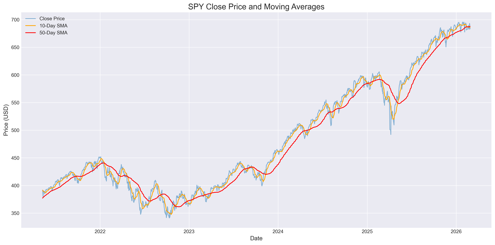
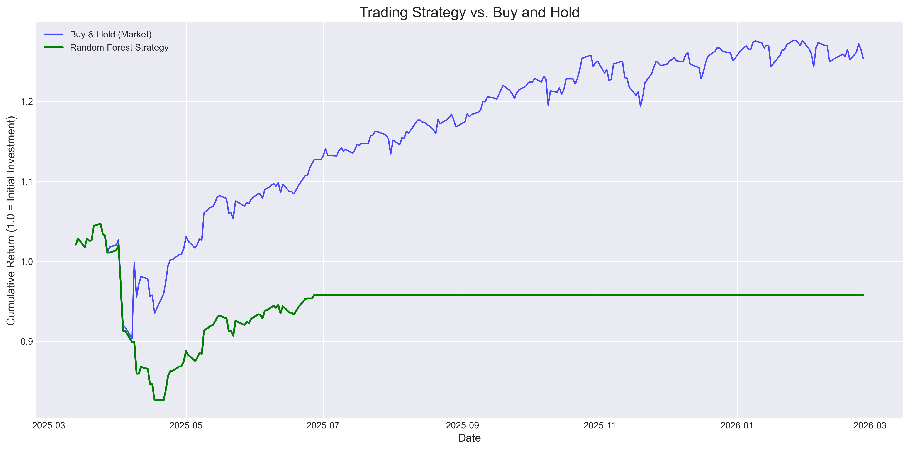

# Quantitative Market Forecasting: S&P 500 Directional Backtest

**Author:** Bayan Taqi

## 📌 Executive Summary
This project builds an end-to-end machine learning pipeline to forecast the daily directional movement of the S&P 500 index (SPY). Rather than just evaluating model accuracy, this repository simulates a real-world trading strategy to test if historical price action and engineered volatility metrics can generate alpha against a standard Buy-and-Hold baseline.

## 🛠️ The Tech Stack
* **Language:** Python
* **Data Acquisition:** `yfinance` (Yahoo Finance API)
* **Data Manipulation:** `pandas`, `numpy`
* **Machine Learning:** `scikit-learn` (Logistic Regression, Random Forest Classifier)
* **Visualization:** `matplotlib`

## 📊 Feature Engineering
To translate raw price data into quantifiable market signals, the following features were engineered:
* **Daily Returns:** Percentage change from the previous closing price.
* **Momentum Indicators:** 10-day and 50-day Simple Moving Averages (SMA) to smooth stochastic noise and capture short/medium-term trends.
* **Volatility Proxy:** 20-day rolling standard deviation of daily returns to quantify market risk.

*(Note: Ensure your chart is uploaded to the `/images` folder for this to display)*

## 🤖 Modeling & Backtesting Results
To prevent data leakage, a strict temporal train/test split (80/20) was utilized. 

### 1. The Baseline: Logistic Regression
* **Accuracy:** 57.85%
* **Insight:** While seemingly accurate, the model exhibited extreme class imbalance in its recall. It defaulted to a "lazy" state, predicting positive returns (Up) almost universally due to the market's inherent upward drift, failing to identify actual market downturns.

### 2. The Advanced Strategy: Random Forest Classifier
* **Accuracy:** 47.52%
* **Insight:** By utilizing an ensemble of decision trees (max depth = 5 to prevent overfitting), the model successfully identified market volatility, drastically improving its recall for negative (Down) days to 0.74. 
* **The Backtest Reality:** In the simulated trading environment, the model became highly risk-averse. By constantly predicting market downturns, the algorithm shifted the portfolio into cash. Consequently, the strategy's cumulative returns flatlined, ultimately underperforming the broader S&P 500 Buy-and-Hold strategy.

*(Note: Ensure your chart is uploaded to the `/images` folder for this to display)*

## 💡 Analytical Conclusion
This project demonstrates a fundamental truth of quantitative finance: highly efficient markets are incredibly difficult to predict using historical price data alone. While complex models like Random Forests can map non-linear volatility, using them purely on price-action often results in overly conservative trading strategies that miss out on long-term market growth. Future iterations of this pipeline would require alternative data sources (e.g., macroeconomic indicators, fundamental data, or sentiment analysis) to uncover a profitable edge.

## 📂 Repository Structure
* `/notebooks`: Contains the core Jupyter Notebook (`Financial Time Series Forcast.ipynb`) with the complete, documented data pipeline.
* `/images`: High-resolution Matplotlib visualizations of the engineered features and backtest results.
* `requirements.txt`: Environment dependencies required to reproduce the notebook.

## 🚀 How to Run
1. Clone the repository.
2. Install the required packages: `pip install -r requirements.txt`
3. Launch the Jupyter Notebook in the `/notebooks` directory.
