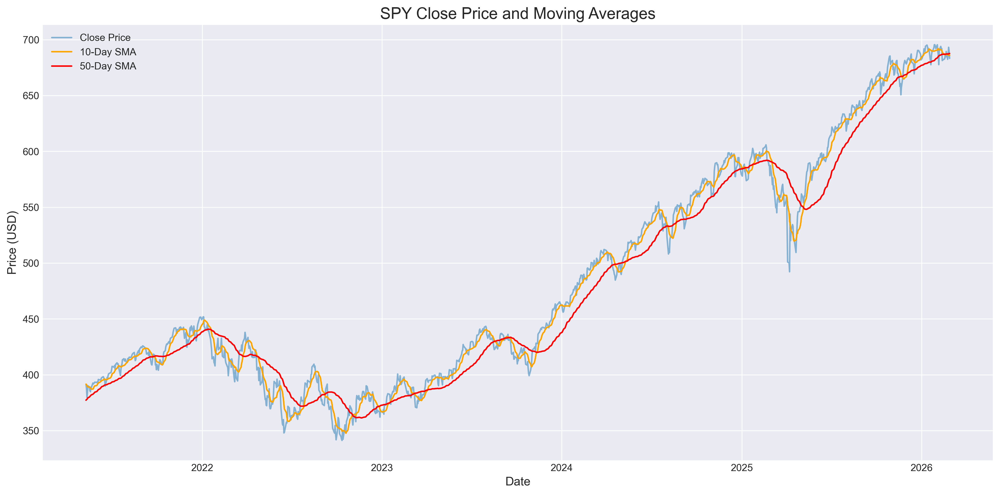

# Financial Time-Series Data Pipeline & Forecasting

**Goal:** To build an automated data pipeline that ingests historical financial data, cleans and standardizes the dataset, and applies machine learning to forecast future market trends. 

Businesses generate massive amounts of time-series data (sales, traffic, revenue). This project demonstrates my ability to take raw, chaotic time-series data and transform it into a structured format ready for predictive analysis and visual reporting.

## The Data Pipeline Process
1. **Data Ingestion & Cleaning:** Handled missing values, standardized datetime indexes, and removed outliers using `pandas` to ensure high-fidelity inputs.
2. **Feature Engineering:** Calculated rolling averages, volatility metrics, and momentum indicators to provide the model with actionable context.
3. **Predictive Modeling:** Deployed statistical and machine learning models to forecast future S&P 500 movements based on historical patterns.
4. **Visual Reporting:** Generated automated, clean visual reports using `matplotlib` and `seaborn` to make the data instantly readable for non-technical stakeholders.

## Technologies Used
* **Python** (Pandas, NumPy, Scikit-Learn)
* **Data Visualization** (Matplotlib, Seaborn)
* **Jupyter Notebooks** for reproducible reporting

